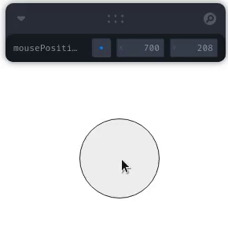

# Controlled Inputs

## set

To change values in Leva store from the outside, use the function API by passing `() => schema` to `useControls`.

```jsx
const [{ text }, set] = useControls(() => ({ text: 'my string' }))

return <input type="text" value={text} onChange={(e) => set({ text: e.target.value })} />
```

Use `set` to update values from outside of Leva GUI.

See an [example in Storybook](https://leva.pmnd.rs/?path=/story/misc-controlled-inputs--external-updates-with-set).

## onChange

`onChange` callback in the schema is called for all changes to the value. Values with `onChange` will no longer cause React to rerender (unless passing an additional `transient` flag set to `false`, see below), so you can use it to efficiently update frequently changing values.

```jsx
const divRef = React.useRef(null)
const data = useControls({
  color: {
    value: '#f00',
    onChange: (v) => {
      // imperatively update the world after Leva input changes
      divRef.current.style.color = v
    },
  },
})

// `data.color` is undefined
```

See an [example in Storybook](https://leva.pmnd.rs/?path=/story/misc-input-options--on-change).

### Transient

If you need the `onChange` callback while still wanting to retrieve the input value, you can set `transient: false`.

```jsx
const divRef = React.useRef(null)
const data = useControls({
  color: { value: '#f00', onChange: (v) => {}, transient: false },
})

// `data.color` will be defined
```

## set and onChange

With `set` and `onChange` we can bind to any imperative API. Whenever external

```jsx
const [, set] = useControls(() => ({
  position: {
    value: { x: 0, y: 0 },
    onChange: (value) => {
      // imperatively update the world after Leva input changes
    },
  },
}))

const targetRef = useRef()
useDrag(({ offset: [x, y] }) => set({ position: { x, y } }), { target: targetRef })
```

[codesandbox-drag]: (https://codesandbox.io/s/leva-controlled-input-71dkb?file=/src/App.tsx)

[][codesandbox-drag]

See [this CodeSandbox][codesandbox-drag] for an example.

---

@TODO
This page will go in depth on how to replicate use-cases like https://twitter.com/simonghales/status/1357630773323436033
where the values are being changed outside of the GUI

This page should also probably talk about multi-panes and other non dat.GUI situations
